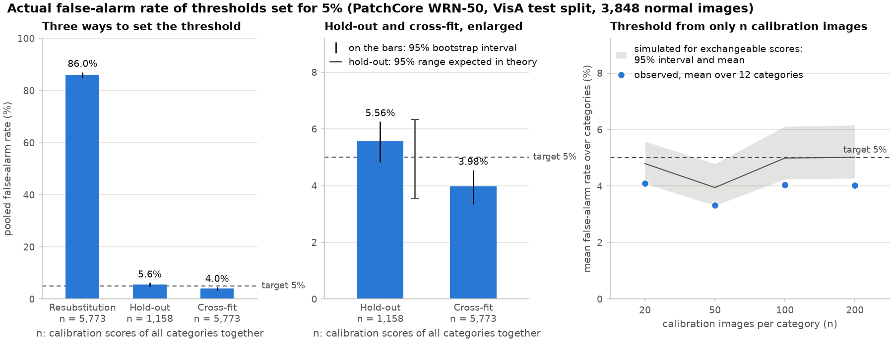
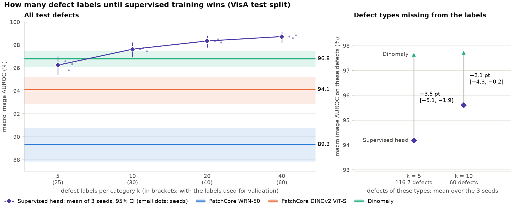
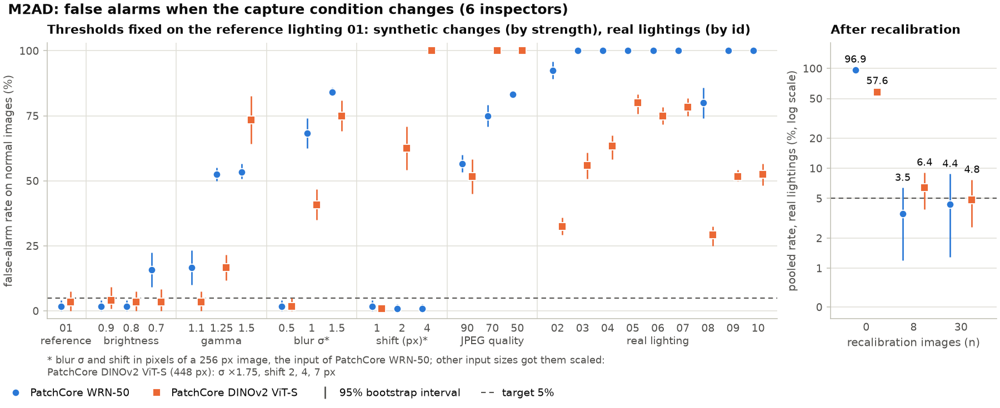
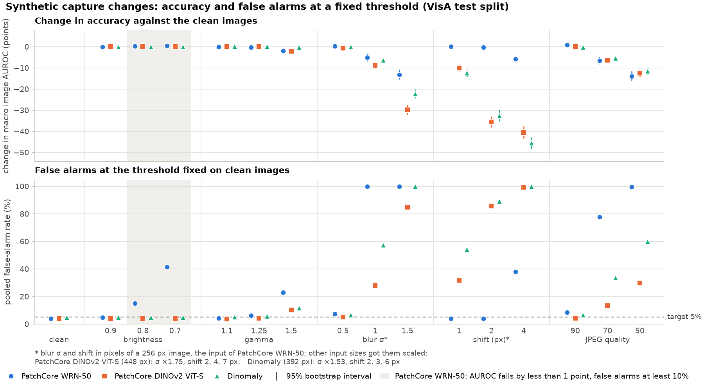
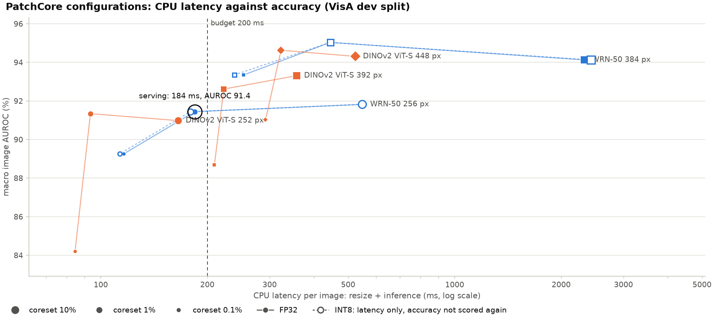
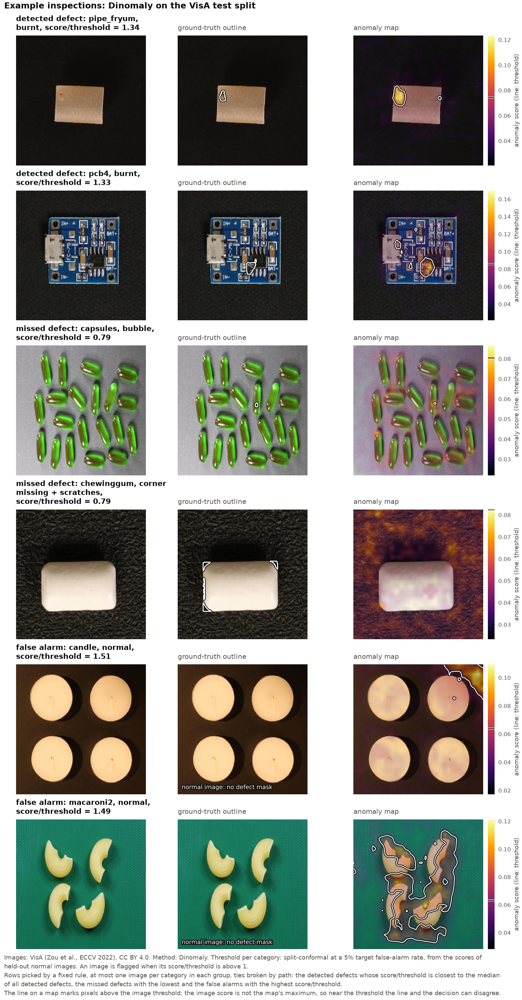
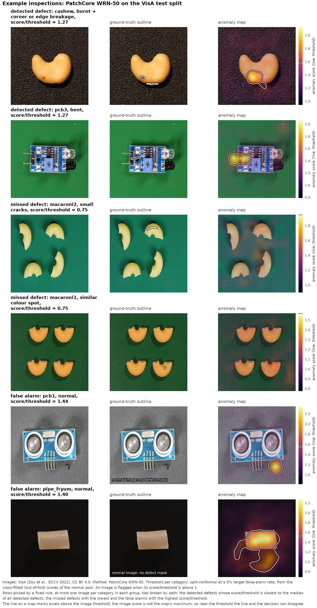

# defect-inspect

정상 제품 사진만으로 만드는 외관 검사기(이상 탐지)를, 현장에서 실제로 굴릴 때 부딪히는 질문으로 재는 프로젝트다.

공개 벤치마크의 AUROC는 이미 포화에 가깝다. 그래서 점수 경쟁 대신 다음을 미리 정한 규칙으로 잰다.

1. 결함 라벨 몇 장부터 지도 학습이 비지도 이상 탐지를 이기는가
2. 정상 이미지로 고정한 임계값의 실제 오검출률은 목표와 얼마나 다른가. 그 차이는 표본이 유한해서 생기는 흔들림인가, 절차의 치우침인가
3. 밝기·흐림 같은 합성 교란은 실제 조명 변화를 대신할 수 있는가
4. CPU에서 장당 200ms 안에 들어오면서 오검출률 기준을 지키는 구성이 남는가

계획은 [docs/plan.md](docs/plan.md), 측정 규칙과 결과는 [docs/experiments.md](docs/experiments.md)에 있다. 규칙은 재기 전에 커밋한다.

## 한눈에
| 질문 | 답 (VisA 봉인 테스트와 M2AD 실제 조명 실험, 미리 정한 규칙으로 판정) |
|---|---|
| 1. 결함 라벨 몇 장부터 지도 학습이 이기나 | 범주당 결함 5장(검증 포함 25장)이면 Dinomaly와 구별되지 않고, 20장(검증 포함 40장)부터 분명히 앞선다(+1.6%p). 그러나 k = 5·10에서 학습에 없던 결함 유형만 보면 2.1~3.5%p 뒤진다(k = 20 이상은 그런 결함이 거의 남지 않아 재지 못했다) |
| 2. 정상 이미지로 고정한 임계값은 목표를 지키나 | 빼 둔 정상으로 잡으면 목표 5%에 실제 5.6%로 유한표본 이론 구간(3.6~6.3%) 안이고, 교차 적합은 4.0%로 목표를 넘지 않는 보수적인 쪽이다. 뱅크를 만든 이미지로 잡으면 86%다. 단, 촬영 조건이 그대로일 때만 그렇다. WideResNet PatchCore 기준으로 조명이 바뀌면(M2AD) 97%, 20~30% 어두워지면(VisA) 15~41%가 된다. M2AD에서 새 조명의 정상 30장을 뱅크에 더하고 임계값을 다시 잡으면 4.4%로 돌아온다(8장으로도 3.5%). 다른 조명 4~5개를 미리 등록해 두면 등록하지 않은 조명에서 55.6%(DINOv2 특징에 이미지별 중심화까지 더하면 11.5%)이고, 라벨 없이 경보를 받아 다음 20장으로 자동 재등록하면 9.4~9.9%다(7단계) |
| 3. 합성 교란이 실제 조명 변화를 대신하나 | 미리 적은 가설("합성 교란은 실제 조명 변화의 절반에도 못 미친다")은 기각됐다. 가장 센 흐림·JPEG는 실제 조명 변화(평균 +95%p)의 85% 안팎까지 오검출을 늘렸다. 그러나 조명을 흉내 낸 밝기 배율(+14%p)과 감마(+52%p)는 실제 조명(모든 조건 +78%p 이상)에 못 미쳐, 밝기 교란만으로는 실제 조명 변화를 어림할 수 없다(이 부분은 규칙 밖의 해석이다) |
| 4. CPU 200ms 안에 들면서 기준을 지키는 구성이 남나 | PatchCore로는 남지 않았다. 4단계에서 규칙대로 고른 구성(WRN-50 256px, 코어셋 1%)은 배포용 뱅크로 CPU 214ms이고 AUROC가 Dinomaly보다 6.8%p 낮아 기준을 지키지 못했다(가설 기각). INT8은 점수가 크게 달라져 쓸 수 없었다. 6단계에서 Dinomaly의 인코더를 DINOv2 ViT-S로 줄여 280px로 학습한 모델은 세 기준을 모두 지켰다(가설 지지): CPU 150ms, 실제 오검출률 4.3%, AUROC 96.5로 GPU Dinomaly(96.8)와 0.3%p 차이, PatchCore보다 +6.4%p [+5.1, +7.8]. 검사 서비스는 이 모델로 바꿨다 |

## 결과
0~4단계와 6·7단계를 쟀다(5단계는 이 README와 그림이다). 자세한 표와 판정, 규칙 변경 기록은 [docs/experiments.md](docs/experiments.md)에 있다.

**기준선 (PatchCore, WideResNet-50, 256px).** VisA 공식 `2cls_highshot` 테스트(정상 3,848장, 결함 480장)에서 평균 이미지 AUROC 89.3 [87.8, 90.8], AUPRO 90.5. 결함의 95%를 잡으려면 정상의 34%를 불량으로 돌려야 한다.

**임계값을 정상 이미지만으로 정하는 세 가지 방법** (목표 오검출률 5%, 12개 범주 합산)

| 방식 | 실제 오검출률 | 검출률 | 미리 적어 둔 가설 | 판정 |
|---|---|---|---|---|
| 재대입: 뱅크를 만든 이미지의 점수로 임계값을 정함 | 86.0% | 100% | 목표의 두 배 이상이다 | 지지 |
| 홀드아웃: 빼 둔 정상 20%의 점수로 정함 | 5.6% | 68.1% | 이론 구간(3.6~6.3%) 안이다 | 지지 |
| 교차 적합: 겹마다 "그 겹을 뺀 뱅크"로 매긴 점수를 모아 정함 | 4.0% | 66.7% | 목표를 넘지 않는다 | 지지 |

- 뱅크를 만든 이미지로 임계값을 잡으면 정상의 86%가 불량으로 나온다
- 빼 둔 정상으로 잡으면 표본이 범주당 60~121장뿐이어도 이론이 말하는 범위에 들어온다
- 교차 적합은 1%p쯤 보수적이다. 같은 목표에서 어느 쪽이 결함을 더 잡는지는 가리지 못했다(차이 −1.5%p [−2.9, 0.0], 판정 불가)
- 오검출률을 5%로 묶으면 결함의 약 3분의 2를, 1%로 묶으면 절반에 못 미치게 잡는다



**방법을 바꾸면** (같은 테스트, 결함 라벨 0장)

| 방법 | 이미지 AUROC | AUPRO | 목표 오검출률 5%에서의 검출률 (실제 오검출률) |
|---|---|---|---|
| PatchCore, WideResNet-50, 256px | 89.3 [87.8, 90.8] | 90.5 | 66.7% (4.0%) |
| PatchCore, DINOv2 ViT-S, 448px | 94.1 [92.8, 95.2] | 93.3 | 74.6% (4.0%) |
| Dinomaly (DINOv2 ViT-B, 392px, 12개 범주를 한 모델로) | 96.8 [96.1, 97.5] | 96.2 | 80.2% (4.9%) |

**결함 라벨 몇 장부터 지도 학습이 이기는가.** 고정한 DINOv2 ViT-S 특징 위에 작은 헤드를 범주당 결함 k장으로 학습해(시드 3개) Dinomaly와 비교했다.

| 범주당 결함 k장 (검증 20장 별도) | 이미지 AUROC | Dinomaly와의 차이 | 판정 |
|---|---|---|---|
| 5 | 96.2 | −0.6%p [−1.5, +0.4] | 판정 불가 |
| 10 | 97.6 | +0.8%p [+0.0, +1.6] | 차이 작음 |
| 20 | 98.3 | +1.6%p [+0.8, +2.3] | 지도 학습이 높다 |
| 40 | 98.7 | +1.9%p [+1.2, +2.7] | 지도 학습이 높다 |

- "k가 10 이하면 지도 학습이 진다"고 미리 적었는데 k = 10에서는 틀렸고 k = 5에서는 가리지 못했다. 5장이면 구별되지 않고 10장이면 이미 조금 앞선다. 분명히 앞서는 것은 20장부터다
- 그러나 **학습에서 보지 못한 결함 유형**만 모으면 뒤집힌다. k = 5에서 지도 학습이 3.5%p [−5.1, −1.9], k = 10에서 2.1%p [−4.3, −0.2] 낮다. 정상만 쓰는 방법은 결함 유형을 가리지 않는다



**조명이 실제로 바뀌면** (M2AD의 Motor·Bird. 기준선 PatchCore(WideResNet-50, 256px)를 기준 조명에서 만들어 다른 조명 9가지에 그대로 적용)

| | 기준 조명 | 다른 조명 | 새 조명의 정상 30장으로 다시 보정 |
|---|---|---|---|
| 정상을 불량으로 판정한 비율 (목표 5%) | 1.7% | 96.9% | 4.4% [1.3, 8.8] |

- 조명만 바꿨는데 아홉 조건 가운데 일곱에서 정상이 전부 불량으로 나왔다(오검출률 증가 평균 +95.3%p)
- 같은 기준 조명 이미지에 합성 교란(밝기·감마·흐림·이동·JPEG 15가지)을 준 것 가운데 가장 나쁜 조건은 +82.5%p(흐림 σ 1.5)였다. "합성 교란은 실제 조명 변화의 절반에도 못 미칠 것"이라고 미리 적었는데 틀렸다. 다만 가장 큰 영향을 준 것은 조명과 상관없는 흐림과 JPEG 압축이었다. 조명을 흉내 내려고 넣은 밝기 배율은 가장 센 단계에서도 +14.2%p에 그쳤고, 감마는 +51.7%p까지 갔지만 실제 조명(모든 조건 +78%p 이상)에는 못 미쳤다. 밝기만 바꿔 보는 점검으로는 실제 조명 변화를 어림할 수 없다
- 새 조명에서 찍은 정상 30장을 뱅크에 더하고 임계값을 다시 잡으면 오검출률이 목표 근처로 돌아온다 (8장만으로도 3.5%)



**촬영 조건이 조금 바뀌면** (VisA 테스트에 합성 교란 15가지, 1·2단계 테스트에서 정한 임계값을 그대로 사용)

| 교란 | PatchCore WRN-50 | PatchCore DINOv2 | Dinomaly |
|---|---|---|---|
| 없음 | 4.0% | 4.0% | 4.9% |
| 20~30% 어둡게 | 15.2%, 41.4% | 3.9%, 4.1% | 4.8%, 4.8% |
| 1px 이동 (256px 기준) | 4.1% | 31.9% | 54.2% |
| 흐림 σ 1.0 | 99.9% | 28.1% | 57.4% |
| JPEG 품질 70 | 77.6% | 13.3% | 33.5% |

(칸의 값은 목표 5%로 정한 임계값에서 정상을 불량으로 판정한 비율)

- 이미지를 20~30% 어둡게 하면 WideResNet PatchCore의 AUROC는 그대로(+0.3, +0.5%p)인데 오검출률은 15%, 41%로 뛴다. 점수 순서는 거의 그대로인 채 점수 전체가 밀린 것으로 본다(검출률도 같이 오른다). AUROC로 모델을 감시하면 이 고장은 보이지 않는다(미리 적은 가설 지지)
- DINOv2 특징을 쓰는 두 방법은 밝기 배율에는 흔들리지 않는 대신 256px 기준 1~2px(실제 입력에서 2~4px) 어긋남에 크게 무너진다. 어느 방법을 쓰든 고정 임계값은 촬영 조건(노출·초점·압축·위치 맞춤)과 한 묶음이다



**CPU 200ms 안에 넣으려면** (PatchCore 다섯 설정 × 코어셋 세 비율을 dev로 재서 CPU 지연 200ms 이하 가운데 dev AUROC가 가장 높은 것을 고르고, 그 설정(WRN-50 256px)의 코어셋 세 비율과 서빙 아티팩트만 봉인 테스트로 잼)

| 구성 | 이미지 AUROC | 실제 오검출률 (목표 5%) | 검출률 | CPU 지연 (Ryzen 5 3600) | GPU 지연 (RTX 2080 Ti) |
|---|---|---|---|---|---|
| WRN-50 256px, 코어셋 10% (1단계 기준선) | 89.3 | 4.0% | 66.7% | 550ms (dev 뱅크) | 25ms (dev 뱅크) |
| WRN-50 256px, 코어셋 1% (서빙 구성), torch GPU | 90.0 | 4.2% | 67.1% | - | 11ms |
| 같은 구성, onnxruntime CPU FP32 | 90.0 | 4.2% | 67.1% | 184ms (dev 뱅크) / 214ms (배포용 뱅크) | - |
| 같은 구성, onnxruntime CPU INT8 (임계값 다시 잡음) | 82.9 | 3.8% | 49.0% | 191ms (배포용 뱅크) | - |

(CPU 지연은 원본 1500×1000 사진의 리사이즈(약 8ms)를 포함한 장당 중앙값이고, GPU 지연은 리사이즈를 뺀 값이다. 지연은 모두 범주 pcb1, AUROC 등은 봉인 테스트)

- 코어셋을 10%에서 1%로 줄이면 정확도는 그대로이고(+0.7%p [−0.2, +1.6], 미리 적은 가설 지지), CPU 지연은 550ms에서 184ms로 준다. WideResNet의 10% 뱅크에서는 최근접 탐색이 지연의 대부분이다
- CPU로 옮겨도 점수는 같다. onnxruntime FP32 점수는 GPU 점수와 중앙값 0.012% 차이이고, GPU에서 정한 임계값을 그대로 써도 오검출률이 같다
- INT8(정적 양자화)은 점수를 중앙값 24% 바꾼다. FP32 임계값을 그대로 쓰면 정상의 68%를 불량으로 판정한다(가설 지지). 다시 잡으면 오검출률은 돌아오지만 AUROC가 7.1%p 떨어지고, 속도 이득은 3~10%(측정에 따라 다르고, 큰 쪽의 절반은 정밀도와 무관한 탐색 시간의 흔들림)뿐이다
- 서빙 구성을 고를 때는 dev 뱅크(풀의 4/5)로 쟀지만, 배포할 뱅크는 풀 전체라 25% 크다. 뱅크 크기만으로도 약 205ms로 계산되고, 실측은 214ms여서 예산을 넘었다. 예산 근처에서는 배포할 뱅크 크기로 재야 한다
- 처음 지연을 잴 때는 이 PC에서 게임이 돌고 있었다. 한가할 때 다시 잰 값이 15개 구성 중 14개에서 13~40% 짧았고(한 구성만 4% 길었다), 처음 값으로는 다른 구성(DINOv2 252px)이 뽑혔다. 한가할 때 다시 재기로 규칙을 고친 뒤(재측정 전에 커밋) 다시 쟀다
- 결론(가설 기각): 규칙대로 고른 서빙 구성은 배포용 뱅크로 CPU 214ms이고 AUROC가 Dinomaly보다 6.8%p 낮아서, "CPU 200ms + 오검출률 기준 + Dinomaly보다 2%p 넘게 낮지 않음"을 함께 만족하지 못했다. dev에서도 200ms 안에 든 다섯 구성은 모두 dev AUROC가 Dinomaly보다 5%p 넘게 낮았다. GPU를 두면 같은 PatchCore가 11ms다(리사이즈 제외)



**CPU 서빙 모델을 Dinomaly ViT-S로 바꾸면** (6단계. 학습하지 않은 모델로 CPU 지연 관문을 먼저 열고, 통과한 네 모델(252·280·308px, 280px + CAR)을 학습해 dev로 하나를 고른 뒤, 그 모델만 봉인 테스트로 잼)

| 구성 | 이미지 AUROC | 실제 오검출률 (목표 5%) | 검출률 | CPU 지연 (Ryzen 5 3600) |
|---|---|---|---|---|
| PatchCore WRN-50 256px, 코어셋 1% (4단계 서빙 구성), onnxruntime CPU FP32 | 90.0 [88.5, 91.5] | 4.2% | 67.1% | 214ms (배포용 뱅크) |
| **Dinomaly ViT-S 280px + CAR (6단계), onnxruntime CPU FP32** | **96.5 [95.5, 97.3]** | 4.3% | 83.3% | **150ms** |
| Dinomaly ViT-B 392px (2단계, 참고), torch GPU | 96.8 [96.1, 97.5] | 4.9% | 80.2% | 재지 않음 |

(CPU 지연은 원본 1500×1000 사진의 리사이즈(약 8ms)를 포함한 장당 중앙값이고, CPU가 한가할 때 쟀다. 6단계 모델의 임계값은 학습에 쓰지 않은 정상(겹 0)으로 정했다)

- 미리 적은 두 가설이 모두 지지됐다. "CPU 200ms + 오검출률 6% 이하 + GPU Dinomaly보다 2%p 넘게 낮지 않음"을 함께 만족했고, 서빙 PatchCore보다 AUROC가 +6.4%p [+5.1, +7.8] 높다. 차이는 작은 결함이 많은 macaroni2(+28.8), capsules(+16.0), macaroni1(+13.3)에서 크다
- 인코더를 ViT-S로 줄이고, 읽지 않는 마지막 두 블록을 자르고, 입력 크기를 고정해 ONNX로 내보냈다. 메모리 뱅크가 없어서 dev에서 잰 그래프가 그대로 배포되고(4단계처럼 배포용 뱅크로 지연이 늘지 않는다), 12개 범주가 모델 하나를 같이 쓴다. CPU 점수는 GPU 점수와 상대 차이가 최대 7e-6이다
- 결함을 95% 잡는 지점의 오검출률은 17.6%로 GPU Dinomaly(12.0%)보다 높다. capsules(88.3)와 pcb3(92.5)은 GPU Dinomaly보다 낮다
- 6단계 모델은 디코더 선형 어텐션의 키를 토큰 수로 나누는 패치(출력은 수식상 같고 fp32에서 손실 차이 0)를 넣고 fp16으로 학습했다. ViT-S의 60스텝 관문(280px)과 10,000스텝 학습 네 번(252~308px) 모두 손실이 유한했고 건너뛴 스텝이 없었으며, 모델 하나 학습에 약 15분(VRAM 1.6GB)이다. 다만 2단계 DM(ViT-B 392px)이 fp16에서 깨진 문제(어텐션 합이 fp16 최댓값을 넘음)를 이 패치가 없애는지는 보이지 않았다. 패치를 넣은 ViT-B 392px와 패치 없는 ViT-S를 fp16으로 돌려 보지 않았고, ViT-S는 토큰 수가 DM의 41~62%라 패치 없이도 넘치지 않았을 수 있다
- Dinomaly2의 CAR(Context-Aware Recentering)을 켜면 dev AUROC가 +0.8%p [+0.1, +1.6] 올랐다(판정하지 않는 보조 수치). 동적 INT8(행렬 곱만)은 18% 빨라지지만(123ms) dev AUROC가 1.4%p 떨어졌다
- 촬영 조건 전제는 그대로다. dev에서 흐림 σ 1.0을 주면 정상의 28.5%가 불량으로 나왔다. 1px 이동은 dev에서 +1.4%p였지만 3단계와 같은 절차로 재지 않았으므로 지그와 위치 맞춤을 전제로 둔다

**조명을 미리 여럿 등록하면, 그리고 바뀐 것을 라벨 없이 알아채면** (7단계. M2AD의 같은 검사기 6개. 기준 조명 I01을 뺀 아홉 조명을 4개·5개 두 묶음으로 나눠, 한 묶음을 I01과 함께 등록하고 다른 묶음을 "못 본 조명"으로 잰 뒤 서로 바꿈. 후보는 학습 시편만으로 고르고 봉인 test는 방법마다 한 번)

| 구성 (목표 5%) | 못 본 조명 오검출률 | 못 본 조명 AUROC | 등록한 조명 오검출률 | 기준 조명 검출률 |
|---|---|---|---|---|
| PatchCore WRN-50, 기준 조명만 (3단계와 같음) | 96.9% | 63.6 | 1.7% | 42.1% |
| 같은 것, 기준 + 조명 4~5개 미리 등록 | 55.6% [51.5, 60.0] | 79.6 | 3.3% | 47.2% |
| PatchCore DINOv2 ViT-S, 기준 조명만 | 57.6% | 70.8 | 3.3% | 22.6% |
| 같은 것, 기준 + 조명 4~5개 등록 + 이미지별 특징 중심화 | 11.5% [8.8, 14.9] | 82.4 | 3.7% | 36.8% |

(후보는 그대로, 이미지별 중심화, 조명 등록, 둘 다의 네 가지였고, 학습 시편 30개로 만든 검증에서 못 본 조명 오검출률이 가장 낮은 것을 골랐다. WRN-50은 등록만 한 것과 둘 다 한 것이 같아 단순한 쪽을 골랐다)

- 미리 등록하면 등록하지 않은 조명의 오검출이 절반쯤 줄지만 목표에는 멀다. "WRN-50에서 50%p 넘게 줄인다"고 미리 적은 가설은 기각됐다(−41.3%p [−45.2, −37.1]). 등록한 조명 안에서는 임계값이 목표를 지킨다(3.3%, 가설 지지). 기준 조명의 검출률은 줄지 않았다(+5.1%p [+2.7, +7.8])
- 조명에 따라 갈린다. 두 조명(I09, I10)은 등록하지 않았는데도 5.8%로 돌아왔고, 두 조명(I05, I07)은 87.5% 이상 그대로다
- 이미지별 특징 중심화(패치 특징에서 그 이미지의 평균 벡터를 뺌)는 WRN-50의 실제 조명 오검출을 줄이지 못했다(검증 95.8% → 95.4%). VisA dev에서 30% 어둡게 한 조건의 오검출은 38.9% → 14.0%로 줄였다. DINOv2 특징에서는 등록과 함께 쓸 때 11.5%까지 내려가지만 남은 오검출의 42%가 I07 한 조명이다
- **라벨 없는 변화 감지.** 이미지 점수의 순위로 만든 conformal p-value를 test martingale에 넣어 경보한다(Vovk et al. 2021). 스트림 자체의 순위를 쓰는 전도형은 VisA 봉인 test 정상 스트림에서 허위 경보가 0.22~0.28%이고 결함이 10% 섞여도 0.19~0.22%다. 보정 점수와 비교하는 귀납형은 M2AD 새 조명에서 WRN-50이 6~7장 만에 모든 스트림에서 경보했지만, 조명이 그대로여도 결함이 10% 섞인 VisA 스트림의 34~61%에서 경보해 "결함이 늘었다"와 "조명이 바뀌었다"를 가르지 못한다
- **경보 뒤 자동 재등록.** 새 조명의 무라벨 20장에서 묶음 안 점수가 가장 높은 4장을 버리고 나머지를 뱅크와 임계값에 더하면 오검출률이 96.9%에서 9.4%(결함 0%), 9.8%(결함 10%, 섞인 결함의 59%를 버림)로 돌아오고 검출률은 63.5~68.8%다. 목표의 두 배이고, 라벨을 확인한 정상 8장으로 사람이 재보정한 3.5%보다 높다. 결함이 없어도 9.4%라서 거르기 자체가 임계값을 낮추는 것으로 본다. 거르지 않으면 섞인 결함 탓에 검출률이 34.3%로 떨어진다
- 이 결과는 PatchCore 메모리 뱅크에 대한 것이다. 서빙 후보 Dinomaly ViT-S는 여러 조명을 등록하려면 다시 학습해야 해서 재지 않았다

## 실패 사례
미리 정한 규칙으로 고른 예시다. 이미지 점수를 그 범주의 임계값(목표 5%)으로 나눈 비를 기준으로, 검출된 결함 가운데 이 비가 전체 검출의 중앙값에 가장 가까운 2장(전형적인 검출), 놓친 결함 가운데 가장 낮은 2장, 오검출 가운데 가장 높은 2장을 골랐다. 한 묶음 안에서 같은 범주는 한 장까지다.





이미지: VisA (Zou et al., ECCV 2022), CC BY 4.0. 256px로 줄인 테스트 이미지에 이상 점수 맵을 겹쳤다.

- **놓친 결함은 작거나 주변과 구별이 어렵다.** 캡슐의 기포, 마카로니의 잔금과 같은 색 얼룩은 256px에서 몇 픽셀이다. chewinggum의 모서리 결손·긁힘은 흰 제품의 윤곽이 조금 깎인 정도라 256px에서 잘 드러나지 않는다. 점수 맵은 결함 네 곳 가운데 한 모서리에서만 조금 올랐고, 배경 질감 여러 곳이 그와 비슷하거나 더 높았다
- **오검출은 제품 밖이나 배치에서 나온다.** PatchCore의 테스트 오검출 가운데 pcb1은 배경에 떨어진 머리카락 같은 이물에 반응한 것이다. 같은 규칙을 dev에 돌렸을 때 나온 PatchCore 오검출 둘(pcb2, pcb4, 그림은 싣지 않음)도 배경의 이물이었다. 제품 결함은 아니지만 현장에서는 오히려 잡고 싶을 수 있다. PatchCore의 pipe_fryum(제품과 그 아래 배경)과 Dinomaly의 macaroni2(네 조각 전체)에서는 넓은 영역이 높게 나왔는데, 원인은 이 그림만으로 가릴 수 없다. Dinomaly의 candle은 배경 구석에 반응했다
- 오검출 예는 3단계의 결론과 같은 쪽이다. 정상만으로 만든 검사기는 "학습 때와 다른 것"을 찾으므로, 결함이 아닌 차이(여기서는 배경의 이물, 3단계에서는 조명·흐림·압축과 DINOv2 계열의 위치 어긋남)도 똑같이 찾는다

## 한계
- 결론은 VisA 12개 범주(범주당 테스트 결함 40장)와 M2AD 2개 범주에서 나온 것이다. 범주별 수치는 구간이 넓어 참고로만 본다
- 비지도 방법의 구성은 문헌 기본값으로 고정했고 범주별로 맞추지 않았다. 2단계 Dinomaly(ViT-B)는 fp16에서 학습이 깨져 fp32·배치 8로 돌렸다(6단계 ViT-S는 어텐션 패치를 넣고 fp16·배치 16으로 학습했다. 패치 없이도 fp16이 되는지는 재지 않았다). 학습한 모델은 모두 시드 하나다
- 6단계 서빙 모델은 dev 결함 240장(범주당 20장)으로 네 후보 가운데 골랐다. 봉인 테스트는 고른 모델 하나만 쟀다
- 지도 학습과 Dinomaly는 백본(ViT-S, ViT-B)과 모델 수(범주별, 통합)가 달라 조건을 맞춘 비교가 아니다
- 합성 교란은 줄인 이미지에 준 것이라 실제 노출·초점 변화와 같지 않다. 실제 조명 변화는 M2AD 2개 범주로만 쟀다
- 7단계의 조명 묶음은 SHA-256 순으로 한 번만 나눴고(두 묶음을 서로 바꿔 재지만 나누는 방식은 하나), 정상 시편이 범주당 20개라 오검출률 구간이 넓다. 조명 등록·중심화·자동 재등록은 PatchCore 뱅크로만 쟀다. 변화 감지의 경보 시점과 경보 뒤 재등록은 따로 쟀고 한 스트림으로 이어 돌리지 않았다
- 지연은 한 대의 PC(Ryzen 5 3600, RTX 2080 Ti)에서 범주 하나로 쟀다. 임베디드 장비는 재지 않았다
- 측정 도중 규칙을 여섯 번 고쳤다. 여섯 번 모두 해당 단계의 봉인 테스트를 재기 전에 고쳤지만, 여섯 번째(서빙 구성을 고를 지연을 한가할 때 다시 잰 값으로 함)는 dev 격자 결과와 처음 잰 지연을 본 뒤에 정했고, 그 때문에 고른 구성이 바뀌었다. 이유와 시점은 [규칙 변경 기록](docs/experiments.md#규칙-변경-기록)에 있다

## 데이터와 라이선스
| 이름 | 쓰임 | 라이선스 | 근거 |
|---|---|---|---|
| [VisA](https://github.com/amazon-science/spot-diff) | 주 데이터 | CC BY 4.0 | 공식 저장소 README의 License 절, [LICENSE-DATASET](https://github.com/amazon-science/spot-diff/blob/main/LICENSE-DATASET), [AWS Open Data Registry](https://registry.opendata.aws/visa/) |
| [M2AD](https://huggingface.co/datasets/ChengYuQi99/M2AD) | 실제 조명 변화 (3·7단계, 2개 범주) | Apache-2.0 | Hugging Face 데이터셋 카드의 license 표기 |

데이터는 저장소에 넣지 않는다. 다운로드 스크립트와 분할 매니페스트(파일 경로 목록)만 둔다.

VisA: Zou et al., "SPot-the-Difference Self-Supervised Pre-training for Anomaly Detection and Segmentation", ECCV 2022.

## 설치와 테스트
```bash
uv sync                                   # 지표·분할·임계값 보정 코드 (numpy, scipy, pillow)
uv sync --group serve                     # 검사 서비스까지 (onnxruntime, FastAPI; torch 없음)
uv sync --group train --group dinomaly --group serve   # 특징 추출·학습·내보내기까지 (torch CUDA 12.8 빌드)
uv sync --group figures                   # README 그림을 다시 그릴 때 (matplotlib)
uv run pytest -q
uv run ruff check .
uv run ruff format --check .
```

## 재현 명령
```bash
# 0단계: 데이터와 분할
uv run python -m defect_inspect.download               # VisA tar (1.93GB, sha256 검증)
uv run python -m defect_inspect.splits                 # manifests/visa.csv
uv run python -m defect_inspect.cache --size 256       # 리사이즈 캐시 (448, 392 등도 같은 방식)

# 1단계: 기준선과 임계값 보정 (dev로 점검한 뒤 test는 한 번)
uv run python -m defect_inspect.run_patchcore --config p0 --protocol dev
uv run python -m defect_inspect.analyze outputs/p0-dev --stage stage1
uv run python -m defect_inspect.run_patchcore --config p0 --protocol test --allow-test --stage 1 --save-bank
uv run python -m defect_inspect.analyze outputs/p0-test --stage stage1

# 2단계: 다른 백본, Dinomaly, 지도 학습
uv run python -m defect_inspect.run_patchcore --config d-s --protocol test --allow-test --stage 2 --save-bank
uv run python -m defect_inspect.analyze outputs/d-s-test --stage stage2
uv run python -m defect_inspect.run_dinomaly train --no-amp --batch-size 8
uv run python -m defect_inspect.run_dinomaly eval --protocol test --allow-test --stage 2
uv run python -m defect_inspect.run_supervised --protocol test --allow-test --stage 2
uv run python -m defect_inspect.compare --protocol test --dinomaly --supervised --reference dm

# 3단계: 합성 교란(VisA)과 실제 조명 변화(M2AD)
uv run python -m defect_inspect.run_perturb --method p0 --protocol test --allow-test --stage 3   # d-s, dm 도 같은 방식
uv run python -m defect_inspect.analyze_perturb --protocol test
uv run python -m defect_inspect.m2ad --size 256        # data/raw/m2ad 의 zip에서 캐시 생성 (D-S용 448도)
uv run python -m defect_inspect.run_m2ad --method p0 --allow-test --stage 3-m2ad      # d-s 도 같은 방식
uv run python -m defect_inspect.analyze_m2ad --methods p0 d-s

# 4단계: 코어셋·해상도 격자, 내보내기, 지연
# (격자·내보내기·지연은 다섯 설정 wrn50-256/384, dinov2_vits14-252/392/448과 비율 0.1/0.01/0.001 모두에 같은 방식. DINOv2는 export --no-int8)
uv run python -m defect_inspect.run_grid --backbone wrn50 --size 256 --protocol dev --save-banks
uv run python -m defect_inspect.export --grid outputs/grid-wrn50-256-dev --ratio 0.01 --out artifacts/wrn50-256-r0.01
uv run python -m defect_inspect.bench --artifacts artifacts/wrn50-256-r0.01 --category pcb1 --precision fp32 int8 --gpu --key wrn50-256-r0.01
uv run python -m defect_inspect.analyze_grid --protocol dev        # 서빙 구성 선택
uv run python -m defect_inspect.run_grid --backbone wrn50 --size 256 --protocol test --allow-test --stage 4 --save-banks
uv run python -m defect_inspect.export --grid outputs/grid-wrn50-256-test --ratio 0.01 --out artifacts/serving-wrn50-256-r0.01
uv run python -m defect_inspect.run_export_eval --grid outputs/grid-wrn50-256-test --ratio 0.01 --artifacts artifacts/serving-wrn50-256-r0.01 --precision fp32 int8 --allow-test --stage 4
uv run python -m defect_inspect.analyze_export outputs/export-serving-wrn50-256-r0.01-test
uv run python -m defect_inspect.analyze_grid --protocol test --settings wrn50-256
uv run python -m defect_inspect.bench --artifacts artifacts/serving-wrn50-256-r0.01 --category pcb1 --precision fp32 int8 --gpu --key serving-wrn50-256-r0.01-test

# 6단계: CPU 서빙용 Dinomaly ViT-S (관문 → 학습 → dev 선택 → 봉인 테스트)
# (크기는 dms-252/280/294/308, CAR은 dms-252-car/280-car. 캐시는 cache --size 280 처럼 크기마다)
uv run python -m defect_inspect.dinomaly_serving export --config dms-280 --untrained --int8-dynamic   # 관문 1: 학습 전 지연
uv run python -m defect_inspect.bench --artifacts artifacts/dms-280-untrained --category pcb1 --precision fp32 int8-dynamic --key dms-280-untrained --out reports/stage6/latency.json
uv run python -m defect_inspect.analyze_stage6 gate
uv run python -m defect_inspect.run_dinomaly parity --config dms-280 --device cpu   # 관문 2 (가)
uv run python -m defect_inspect.run_dinomaly gate --config dms-280                  # 관문 2 (나), GPU
uv run python -m defect_inspect.run_dinomaly train --config dms-280-car --precision-from outputs/gate-dms-280/gate.json   # dms-252, dms-280, dms-308 도
uv run python -m defect_inspect.run_dinomaly eval --config dms-280-car --protocol dev --no-amp
uv run python -m defect_inspect.analyze_stage6 dev --runs outputs/dms-252-dev outputs/dms-280-dev outputs/dms-308-dev outputs/dms-280-car-dev
uv run python -m defect_inspect.run_dinomaly eval --config dms-280-car --protocol test --allow-test --stage 6 --no-amp
uv run python -m defect_inspect.dinomaly_serving export --config dms-280-car --model outputs/dms-280-car/model.pt --int8-dynamic
uv run python -m defect_inspect.dinomaly_serving score --artifacts artifacts/dms-280-car --protocol test --allow-test --stage 6
uv run python -m defect_inspect.bench --artifacts artifacts/dms-280-car --category pcb1 --precision fp32 int8-dynamic --key dms-280-car --out reports/stage6/latency.json
uv run python -m defect_inspect.analyze_stage6 test --torch outputs/dms-280-car-test --onnx outputs/dms-280-car-onnx-fp32-test --latency-key dms-280-car
uv run python -m defect_inspect.dinomaly_serving score --artifacts artifacts/dms-280-car --protocol dev   # --condition shift-1, --condition blur-2, --precision int8-dynamic 도
uv run python -m defect_inspect.analyze_stage6 supplement --clean outputs/dms-280-car-onnx-fp32-dev --conditions outputs/dms-280-car-onnx-fp32-dev-shift-1 outputs/dms-280-car-onnx-fp32-dev-blur-2 --int8 outputs/dms-280-car-onnx-int8-dynamic-dev
uv run python -m defect_inspect.dinomaly_serving calibrate --artifacts artifacts/dms-280-car --scores outputs/dms-280-car-onnx-fp32-test   # 서비스용 임계값

# 7단계: 조명 변화 대응(M2AD)과 라벨 없는 변화 감지
uv run python -m defect_inspect.drift                     # 저장된 점수만 읽는다 (reports/stage7/drift.json)
uv run python -m defect_inspect.run_m2ad_enrol val --method p0   # d-s 도. 학습 시편만 읽는다
uv run python -m defect_inspect.analyze_m2ad_enrol val           # 후보 선택 (reports/stage7/val.json)
uv run python -m defect_inspect.run_patchcore --config p0-c --protocol dev --save-bank   # d-s-c 도, E0은 --config p0 --out outputs/p0-dev7
uv run python -m defect_inspect.run_perturb --method p0-c --protocol dev --conditions clean brightness-3 gamma-3
uv run python -m defect_inspect.analyze_m2ad_enrol visa-dev
uv run python -m defect_inspect.run_m2ad_enrol test --method p0 --pick-from reports/stage7/val.json --loop --allow-test --stage 7-m2ad   # d-s 는 --loop 없이
uv run python -m defect_inspect.analyze_m2ad_enrol test

# README 그림 (reports/ 의 리포트에서 docs/figures/*.png 를 다시 그린다)
uv run python -m defect_inspect.figures
uv run python -m defect_inspect.figures --examples outputs/dm-test --allow-test --name examples-dinomaly
uv run python -m defect_inspect.figures --examples outputs/p0-test --allow-test --name examples-patchcore
```
`--allow-test`가 붙은 실행은 봉인 테스트 이미지(`run_m2ad`는 M2AD 테스트 이미지)를 읽고, 읽을 때마다 `reports/test_ledger.jsonl`에 한 줄을 남긴다. 테스트 이미지를 캐시로 옮기는 `cache`와 `m2ad`도 한 줄을 남긴다. `--protocol test`만 붙은 분석 명령(`compare`, `analyze_perturb`, `analyze_grid`)은 저장된 점수만 읽는다. 지연은 다른 프로그램이 CPU를 쓰지 않을 때 잰다(규칙 변경 6).

## 검사 서비스
torch 없이 onnxruntime만으로 CPU에서 돈다. 6단계에서 가설을 지지한 Dinomaly ViT-S 모델(280px + CAR, `artifacts/dms-280-car`, FP32)을 서빙한다(2026-10-04에 4단계 PatchCore에서 바꿈). ONNX 모델 하나를 12개 범주가 같이 쓰고, 범주 폴더에는 임계값만 있다(메모리 뱅크 없음). 6단계 봉인 테스트 기준으로 이미지 AUROC 96.5, 목표 오검출률 5%에서 실제 오검출률 4.3%와 검출률 83.3%, 모델 경로의 CPU 지연 150ms(Ryzen 5 3600, CPU가 한가할 때, 1500×1000 사진의 리사이즈 + 정규화 + ONNX 한 번)다. 서비스의 `POST /inspect`는 여기에 업로드 읽기와 디코딩, 히트맵 PNG 인코딩이 더해지므로 응답의 `latency_ms`(데모 페이지의 "처리")는 이보다 크다. 서비스의 전체 응답 시간은 재지 않았다. 4단계 PatchCore 아티팩트(`defect_inspect.export`, 범주별 메모리 뱅크)도 그대로 읽는다. 모델 파일은 저장소에 없으므로 위 재현 명령(6단계의 `dinomaly_serving export`와 `calibrate`)으로 만든다. 교체한 서비스가 dev 이미지 1,398장에 6단계 기록과 같은 점수(최대 상대 차이 0)와 같은 임계값을 내는 것을 확인했다([교체 점검](docs/experiments.md#서비스-모델-교체-점검-규칙-2026-10-04-교체-전)).

```bash
# 모델 파일 없이 도는 합성 범주(demo)로 띄워 보기 (작은 PatchCore 흉내, 테스트와 보안 점검용)
uv run uvicorn defect_inspect.service:create_offline_app --factory --port 8093

# 아티팩트로 띄우기 (4단계 PatchCore는 artifacts/serving-wrn50-256-r0.01)
DEFECT_INSPECT_ARTIFACTS=artifacts/dms-280-car uv run uvicorn defect_inspect.service:create_app --factory --port 8093

# Docker (CPU 이미지, 약 650MB. 기본으로 ./artifacts/dms-280-car 를 읽는다)
docker compose up --build
```

| 경로 | 내용 |
|---|---|
| `GET /` | 데모 페이지: 사진을 올리면 판정과 이상 위치를 겹쳐 보여 준다 |
| `POST /inspect` | `image`(파일), `category` → 이상 점수, 임계값, 양품/불량, 히트맵 PNG(base64) |
| `POST /calibrate` | 현재 촬영 조건의 정상 사진 여러 장 → 그 범주의 임계값만 다시 잡는다(모델은 그대로). `DEFECT_INSPECT_ADMIN_TOKEN`을 설정하고 `X-Admin-Token` 헤더로 보내야 하며, 설정하지 않으면 꺼져 있다 |
| `DELETE /calibrate?category=<범주>` | 재보정을 되돌린다. POST와 같은 `X-Admin-Token`이 필요하고, 토큰을 설정하지 않으면 꺼져 있다 |
| `GET /categories`, `GET /healthz` | 범주별 모델 종류(`reconstruction`, `patchcore`)와 이름, 임계값, 상태 |

- 받는 형식은 PNG, JPEG, BMP, TIFF, WebP(채널당 8비트, 투명도 없음)이고 업로드는 파일당 20MB까지다. 16비트 이미지는 조용히 잘리지 않게 거절한다
- 재보정한 임계값은 메모리에만 있다. 다시 띄우면 아티팩트의 값으로 돌아간다
- 촬영 조건이 그대로일 때만 임계값이 목표를 지킨다. 임계값은 학습에 쓰지 않은 정상(겹 0)으로 정했고, dev에서 흐림 σ 1.0을 주면 정상의 28.5%가 불량으로 나왔다. 위치 어긋남은 3단계와 같은 절차로 재지 않았으므로 지그와 위치 맞춤을 전제로 둔다. 조건이 바뀌면 그 조건의 정상 사진으로 `/calibrate`를 부른다(조명이 바뀐 경우의 한계는 3·7단계)
- `DEFECT_INSPECT_PRECISION=int8-dynamic`으로 동적 INT8 모델(모델 경로 지연 123ms)도 띄울 수 있지만, 아티팩트의 임계값은 FP32 점수로 정한 것이라 INT8 점수에 그대로 쓸 때의 오검출률은 재지 않았고, dev AUROC도 1.4%p 낮다. 서빙은 FP32다
- 보안 점검: 서비스를 OpenAPI 명세와 실제 업로드 요청(HAR 시드, `hawk/`)으로 DAST 스캔한다. 설정은 HawkScan(StackHawk, `stackhawk.yml`)과 OWASP ZAP 2.17.0(`zap/automation.yaml`, `zap/run_zap.sh`) 두 가지이고, 관리자 토큰은 실행할 때 환경 변수로 준다. 2026-10-04에 모델 교체 전후를 두 도구로 스캔했고 교체 뒤에 새로 나온 High·Medium은 없었다. HawkScan의 지적은 데모 페이지 폼의 Anti-CSRF 토큰 1건(Medium)뿐이고, 폼은 `fetch()`로만 보내며 서비스가 쿠키를 쓰지 않고 다른 출처의 쓰기 요청을 거절하므로 오탐으로 표시했다. ZAP은 Informational 2건만 냈다. HawkScan 체험이 2026-10-05에 끝나 이후로는 ZAP을 쓴다. 두 도구는 규칙이 달라 결과를 직접 비교하지 않는다. 기록은 [docs/security.md](docs/security.md)
- 기본으로 `localhost`, `127.0.0.1`(uvicorn으로 직접 띄우면 `[::1]`도) 이름으로만 응답한다. 다른 이름이나 주소로 열려면 `DEFECT_INSPECT_ALLOWED_HOSTS`에 쉼표로 적는다. 이 값은 기본 목록을 대신하므로 `localhost,127.0.0.1`도 함께 적는다(compose의 상태 점검이 127.0.0.1로 접속한다)
